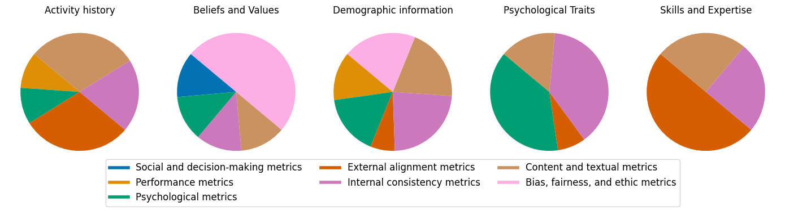

# LLM Role-Playing Agent (RPA) Evaluation Survey

This is the repository for our survey paper:
>[Towards a Design Guideline for RPA Evaluation: A Survey of Large Language Model-Based Role-Playing Agents]()
>
>Chaoran Chen, Bingsheng Yao, Ruishi Zou, Wenyue Hua, Weimin Lyu, Toby Jia-Jun Li, Dakuo Wang
>
>[Arxiv]() | [PDF](assets/Towards_a_Design_Guideline_for_RPA_Evaluation__A_Survey_of_Large_Language_Model_Based_Role_Playing_Agents.pdf) | [Cite](#citation)

## To-Do Items

- [x] Add references to the glossary
- [x] Add distribution diagrams
- [x] Add RPA evaluation design guideline


## Table of Content
- [LLM Role-Playing Agent (RPA) Evaluation Survey](#llm-role-playing-agent-rpa-evaluation-survey)
  - [To-Do Items](#to-do-items)
  - [Table of Content](#table-of-content)
  - [Abstract](#abstract)
  - [RPA Design](#rpa-design)
    - [Agent Attributes](#agent-attributes)
    - [Task Attributes](#task-attributes)
  - [RPA Evaluation Metrics](#rpa-evaluation-metrics)
    - [Agent- \& Task-Oriented Metrics](#agent---task-oriented-metrics)
    - [Relationships Between Agent Attributes and Downstream Tasks](#relationships-between-agent-attributes-and-downstream-tasks)
    - [Evaluation Approach Usage for Agent and Task-Oriented Metrics](#evaluation-approach-usage-for-agent-and-task-oriented-metrics)
  - [RPA Evaluation Design Guideline](#rpa-evaluation-design-guideline)
    - [STEP 1. Selecting Agent-Oriented Metrics Based on Agent Attributes](#step-1-selecting-agent-oriented-metrics-based-on-agent-attributes)
    - [STEP 2. Selecting Task-Oriented Metrics Based on Task Attributes](#step-2-selecting-task-oriented-metrics-based-on-task-attributes)
  - [Citation](#citation)
  - [Glossary](#glossary)
    - [Agent-Oriented Evaluation Metrics Glossary](#agent-oriented-evaluation-metrics-glossary)
    - [Task-Oriented Evaluation Metrics Glossary](#task-oriented-evaluation-metrics-glossary)

## Abstract
Role-Playing Agent (RPA) is an increasingly popular type of LLM Agent that simulates human-like behaviors in a variety of tasks. However, evaluating RPAs is challenging due to diverse task requirements and agent designs.This paper proposes an evidence-based, actionable, and generalizable evaluation design guideline for LLM-based RPA by systematically reviewing $1,676$ papers published between Jan. 2021 and Dec. 2024. Our analysis identifies six agent attributes, seven task attributes, and seven evaluation metrics from existing literature. Based on these findings, we present an RPA evaluation design guideline to help researchers develop more systematic and consistent evaluation methods.

<p align="center">

  
  <em>RPA evaluation design guideline. To illustrate how to use it in practice, we pretended we were selecting the evaluation metrics for the “Stanford Agent Village” (Park et al., 2023) given agent attributes (yellow) and task attributes (pink). The original authors’ selection of evaluation metrics (purple and blue) perfectly aligns with our RPA design guideline, which echoes their work’s robustness.</em>
</p>

## RPA Design

### Agent Attributes

| **Agent Attributes**       | **Definition**                                                                 | **Examples** |
|------------------------|--------------------------------------------------------------------------|----------|
| **Activity History**   | A record of past actions, behaviors, and engagements, including schedules, browsing history, and lifestyle choices. | Backstory, plot, weekly schedule, browsing history, social media posts, lifestyle |
| **Belief and Value**   | The principles, attitudes, and ideological stances that shape an individual’s perspectives and decisions. | Stances, beliefs, attitudes, values, political leaning, religion |
| **Demographic Information** | Personal identifying details such as name, age, education, career, and location. | Name, appearance, gender, age, date of birth, education, location, career, household income |
| **Psychological Traits** | Characteristics related to personality, emotions, interests, and cognitive tendencies. | Personality, hobby and interest, emotional |
| **Skill and Expertise** | The knowledge level, proficiency, and capability in specific domains or technologies. | Knowledge level, technology proficiency, skills |
| **Social Relationships** | The nature and dynamics of interactions with others, including roles, connections, and communication styles. | Parenting styles, interactions with players |

### Task Attributes

| **Task Attributes**           | **Definition** |
|---------------------------|--------------------------------------------------------------|
| **Simulated Individuals** | Simulating specific individuals or groups, such as users and participants. |
| **Simulated Society**     | Simulating social interactions, such as cooperation, competition, and communication. |
| **Opinion Dynamics**      | Simulating political views, legal perspectives, and social media content. |
| **Decision Making**       | Simulating decision-making of stakeholders in investment, public policies, or games. |
| **Psychological Experiments** | Simulating human traits, including personality, ethics, emotions, and mental health. |
| **Educational Training**  | Simulating teachers and learners to enable personalized teaching and accommodate learner needs. |
| **Writing**              | Simulating readers or characters to support character development and audience understanding. |


## RPA Evaluation Metrics

### Agent- & Task-Oriented Metrics

| **Evaluation Metrics**          | **Definitions**     | **Examples**   |
|-----------------------------|---------------------------------------------------------------------------------------------|-----------------------------------|
| **Performance**             | Assess RPAs’ effectiveness in task execution and outcomes.                                  | Prediction accuracy               |
| **Psychological**           | Measure human psychological responses to RPAs and the agents’ self-awareness and emotional state. | Big Five Inventory               |
| **External Alignment**      | Evaluate how closely RPAs align with external ground truth or human behavior and judgments. | Alignment between model and human |
| **Internal Consistency**    | Assess coherence between an RPA’s predefined traits (e.g., personality), contextual expectations, and behavior. | Personality-behavior alignment   |
| **Social and Decision-Making** | Analyze RPAs’ social interactions and decision-making, including their effects on negotiation, societal welfare, markets, and social dynamics. | Social Conflict Count            |
| **Content and Textual**     | Evaluate the quality, coherence, and diversity of RPAs’ text, including semantic understanding, linguistic style, and engagement. | Content similarity               |
| **Bias, Fairness, and Ethics** | Assess biases, extreme or unbalanced content, or stereotyping behavior.                     | Factual error rate               |


### Relationships Between Agent Attributes and Downstream Tasks


<p align="center">

  
  <em>Relationships between agent attributes and downstream tasks. The numbers in the heatmap represent the paper counts.</em>
</p>


### Evaluation Approach Usage for Agent and Task-Oriented Metrics

<p align="center">

  
  <em>Usage ratio of evaluation approaches for each category of agent-oriented metrics.</em>
</p>

<p align="center">

  
  <em>Usage ratio of evaluation approaches for each category of task-oriented metrics.</em>
</p>


## RPA Evaluation Design Guideline

We observed that both agent design and evaluation can be broadly divided into two categories: **agent-oriented** and **task-oriented**. This distinction led us to investigate patterns between agent design and evaluation and derive an RPA evaluation design guideline recommended for future research on RPA. 
We analyzed the distribution of agent attributes and agent-oriented metrics as well as the distribution of task attributes and task-oriented metrics.

For the specific metrics that were used by existing work under each category, please refer to the [glossary](#glossary) below.


### STEP 1. Selecting Agent-Oriented Metrics Based on Agent Attributes

Our analysis reveals that, for each agent attribute, the top three categories of agent-oriented metrics account for the majority of all metric types.
Thus, we recommend future research to employ the top-three types of agent-oriented metrics for each agent attribute designed for the RPA, as listed below.

**Top 3 Frequently Used Agent-Oriented Metrics for Each Agent Attribute**
| **Agent Attributes**       | **Top 3 Agent-Oriented Metrics** |
|------------------------|--------------------------------------------------------------|
| **Activity History**   | External alignment metrics, internal consistency metrics, content and textual metrics |
| **Belief and Value**   | Psychological metrics, bias, fairness, and ethics metrics |
| **Demographic Info.**  | Psychological metrics, internal consistency metrics, external alignment metrics |
| **Psychological Traits** | Psychological metrics, internal consistency metrics, content and textual metrics |
| **Skill and Expertise** | External alignment metrics, internal consistency metrics, content and textual metrics |
| **Social Relationship** | Psychological metrics, external alignment metrics, social and decision-making metrics |

<p align="center">

  
  <em> Proportional distribution of agent-oriented metrics across different agent attributes.</em>
</p>


### STEP 2. Selecting Task-Oriented Metrics Based on Task Attributes

Similarily, we observed that for each category of task attributes, the top three task-oriented metrics account for the vast majority of all metrics.
Thus, we recommend future research to select the top-three types of task-oriented metrics according to task attributes, as listed below.

**Top 3 Frequently Used Task-Oriented Metrics for Each Task Attribute**

| **Task Attributes**         | **Top 3 Task-Oriented Metrics** |
|-------------------------|--------------------------------------------------------------|
| **Simulated Individuals** | Psychological, performance, and internal consistency metrics |
| **Simulated Society**     | Social and decision-making metrics, performance metrics, and psychological metrics |
| **Opinion Dynamics**      | Performance metrics, external alignment metrics, and bias, fairness, and ethics metrics |
| **Decision Making**       | Social and decision-making, performance, and psychological metrics |
| **Psychological Experiment** | Psychological, content and textual, and performance metrics |
| **Educational Training**  | Psychological, performance, and content and textual metrics |
| **Writing**              | Content and textual, psychological, and performance metrics |

<p align="center">

  
  <em> Proportional distribution of task-oriented metrics across different task attributes.</em>
</p>

## Citation

You may cite our paper:
```
@article{chen2025towards,
  title={Towards a Design Guideline for RPA Evaluation: A Survey of Large Language Model-Based Role-Playing Agents},
  author={Chen, Chaoran and Yao, Bingsheng and Zou, Ruishi and Hua, Wenyue and Lyu, Weimin and Li, Toby Jia-Jun and Wang, Dakuo},
  journal={arXiv preprint arXiv:2502.13012},
  year={2025}
}
```


## Glossary

### Agent-Oriented Evaluation Metrics Glossary

| **Attribute** | **Category**       | **Agent-Oriented Metrics**          | **Approach**      | **Source**                     |
|-------------------|-------------------|-------------------------------------|---------------|----------------------------|
| **Belief & Value**       | Bias, fairness, ethics metrics | Exaggeration (normalized average cosine similarity) | Automatic | [Cheng et al., 2023](https://arxiv.org/abs/2310.11501) |
| **Belief & Value**       | Bias, fairness, ethics metrics | Individuation (classification accuracy) | Automatic | [Cheng et al., 2023](https://arxiv.org/abs/2310.11501) |
| **Belief & Value**       | Bias, fairness, ethics metrics | Bias (performance disparity, prevalence, magnitude, variation, attitude shift) | Automatic | [Gupta et al., 2024](https://arxiv.org/abs/2311.04892) |
| **Belief & Value**       | Bias, fairness, ethics metrics | Bias (performance disparity, prevalence, magnitude, variation, attitude shift) | Automatic | [Taubenfeld et al., 2024](https://arxiv.org/pdf/2402.04049) |
| **Demographic Information** | Bias, fairness, ethics metrics | Exaggeration (normalized average cosine similarity) | Automatic | [Cheng et al., 2023](https://arxiv.org/abs/2310.11501) |
| **Demographic Information** | Bias, fairness, ethics metrics | Individuation (classification accuracy) | Automatic | [Cheng et al., 2023](https://arxiv.org/abs/2310.11501) |
| **Demographic Information** | Bias, fairness, ethics metrics | Bias (performance disparity, prevalence, magnitude, variation, attitude shift) | Automatic | [Gupta et al., 2024](https://arxiv.org/abs/2311.04892) |
| **Demographic Information** | Bias, fairness, ethics metrics | Bias (performance disparity, prevalence, magnitude, variation, attitude shift) | Automatic | [Neuberger et al., 2024](https://arxiv.org/abs/2411.03397) |
| **Demographic Information** | Bias, fairness, ethics metrics | Bias (performance disparity, prevalence, magnitude, variation, attitude shift) | Automatic | [Taubenfeld et al., 2024](https://arxiv.org/pdf/2402.04049) |
| **Demographic Information** | Bias, fairness, ethics metrics | Message toxicity | Automatic | [Fang et al., 2024](https://arxiv.org/pdf/2407.08067) |
| **Activity History**      | Content and textual metrics   | Coherence | LLM | [Li et al., 2024e](https://aclanthology.org/2024.emnlp-demo.39.pdf) |
| **Activity History**      | Content and textual metrics   | Clarity | Human | [Chen et al., 2024b](https://dl.acm.org/doi/10.1145/3613904.3642363) |
| **Activity History**      | Content and textual metrics   | Diversity of dialog (Shannon entropy, intra-remote-clique, inter-remote-clique, semantic similarity, longest common subsequence similarity) | Automatic | [Ha et al., 2024](https://dl.acm.org/doi/pdf/10.1145/3613904.3642472) |
| **Belief & Value**       | Content and textual metrics   | Diversity of dialog (Shannon entropy, intra-remote-clique, inter-remote-clique, semantic similarity, longest common subsequence similarity) | Automatic | [Gu et al., 2024](https://arxiv.org/abs/2403.13433) |
| **Demographic Information** | Content and textual metrics | Coherence | LLM | [Li et al., 2024e](Schema-Guided Culture-Aware Complex Event Simulation with Multi-Agent Role-Play) |
| **Demographic Information** | Content and textual metrics | Attitudes (topic term frequency) | Automatic | [Fang et al., 2024](https://arxiv.org/pdf/2407.08067) |
| **Demographic Information** | Content and textual metrics | Diversity of dialog (Shannon entropy, intra-remote-clique, inter-remote-clique, semantic similarity, longest common subsequence similarity) | Automatic | [Fang et al., 2024](https://arxiv.org/pdf/2407.08067) |
| **Demographic Information** | Content and textual metrics | Clarity | Human | [Chen et al., 2024b](https://dl.acm.org/doi/10.1145/3613904.3642363) |
| **Demographic information** |	Content and textual metrics	| Diversity of dialog (Shannon entropy, intra-remote-clique, inter-remote-clique, semantic similarity, longest common subsequence similarity)	| Automatic	| [Ha et al., 2024](https://dl.acm.org/doi/pdf/10.1145/3613904.3642472) |
| **Demographic Information** | Content and textual metrics | Linguistic complexity (utterance length, Kolmogorov complexity) | Automatic | [Milička et al., 2024](https://journals.plos.org/plosone/article?id=10.1371/journal.pone.0298522) |
| **Psychological Traits**  | Content and textual metrics  | Text similarity (BLEU, ROUGE) | Automatic | [Zeng et al., 2024](https://arxiv.org/pdf/2407.12393) |
| **Psychological Traits**  | Content and textual metrics  | Tone Alignment | LLM | [Zeng et al., 2024](https://arxiv.org/pdf/2407.12393) |
| **Skills and Expertise**  | Content and textual metrics  | Coherence | LLM | [Li et al., 2024e](https://aclanthology.org/2024.emnlp-demo.39.pdf) |
| **Activity History**      | Content and textual metrics   | Believability/Credibility(self-knowledge) | Human | [Park et al., 2023](https://dl.acm.org/doi/abs/10.1145/3586183.3606763) |
| **Demographic Information** | Content and textual metrics | Believability/Credibility (self-knowledge) | Human | [Park et al., 2023](https://dl.acm.org/doi/abs/10.1145/3586183.3606763) |
| **Activity History**      | External alignment metrics   | Hallucination | LLM | [Shao et al., 2023](https://aclanthology.org/2023.emnlp-main.814v1.pdf) |
| **Activity History**      | External alignment metrics   | Entailment | LLM | [Li et al., 2024e](https://aclanthology.org/2024.emnlp-demo.39.pdf) |
| **Activity History**      | External alignment metrics   | Believability/Credibility(reactions) | Human | [Park et al., 2023](https://dl.acm.org/doi/abs/10.1145/3586183.3606763) |
| **Demographic Information** | External alignment metrics | Entailment | LLM | [Li et al., 2024e](https://aclanthology.org/2024.emnlp-demo.39.pdf) |
| **Demographic Information** | External alignment metrics | Believability/Credibility (reactions) | Human | [Park et al., 2023](https://dl.acm.org/doi/abs/10.1145/3586183.3606763) |
| **Psychological Traits**  | External alignment metrics  | Fact Accuracy | LLM | [Zeng et al., 2024](https://arxiv.org/pdf/2407.12393) |
| **Skills and Expertise**  | External alignment metrics  | Hallucination | LLM | [Shao et al., 2023](https://aclanthology.org/2023.emnlp-main.814v1.pdf) |
| **Skills and Expertise**  | External alignment metrics  | Entailment | LLM | [Li et al., 2024e](https://aclanthology.org/2024.emnlp-demo.39.pdf) |
| **Activity History**      | External alignment metrics   | Believability/Credibility(memory, plans) | Human | [Park et al., 2023](https://dl.acm.org/doi/abs/10.1145/3586183.3606763) |
| **Demographic Information**  | External alignment metrics   | Believability/Credibility(memory, plans) | Human | [Park et al., 2023](https://dl.acm.org/doi/abs/10.1145/3586183.3606763) |
| **Activity History**      | Internal consistency metrics | Stability | LLM | [Shao et al., 2023](https://aclanthology.org/2023.emnlp-main.814v1.pdf) |
| **Activity History**      | Internal consistency metrics | Consistency of information | Human | [Chen et al., 2024b](https://dl.acm.org/doi/10.1145/3613904.3642363) |
| **Belief & Value**        | Internal consistency metrics | Attitude shift | LLM | [Wang et al., 2024e](https://arxiv.org/pdf/2402.04050) |
| **Demographic Information** | Internal consistency metrics | Stability | LLM | [Shao et al., 2023](https://aclanthology.org/2023.emnlp-main.814v1.pdf) |
| **Demographic Information** | Internal consistency metrics | Attitude shift | LLM | [Neuberger et al., 2024](https://arxiv.org/abs/2411.03397) |
| **Demographic Information** | Internal consistency metrics | Attitude shift | LLM | [Taubenfeld et al., 2024](https://arxiv.org/pdf/2402.04049) |
| **Demographic Information** | Internal consistency metrics | Behavior stability (mean, standard deviation) | Automatic | [Wang et al., 2024g](https://arxiv.org/pdf/2410.16301) |
| **Demographic Information** | Internal consistency metrics | Consistency of information | Human | [Chen et al., 2024b](https://dl.acm.org/doi/10.1145/3613904.3642363) |
| **Demographic Information** | Internal consistency metrics | Consistency of psychological state / personalities | Human | [Chen et al., 2024b](https://dl.acm.org/doi/10.1145/3613904.3642363) |
| **Demographic Information** | Internal consistency metrics | Consistency of information | Human | [Zeng et al., 2024](https://arxiv.org/pdf/2407.12393) |
| **Psychological Traits**  | Internal consistency metrics  | Stability | LLM | [Shao et al., 2023](https://aclanthology.org/2023.emnlp-main.814v1.pdf) |
| **Psychological Traits**  | Internal consistency metrics  | Consistency of information | Human | [Zeng et al., 2024](https://arxiv.org/pdf/2407.12393) |
| **Psychological Traits**  | Internal consistency metrics  | Consistency of psychological state / personalities | Human | [Zeng et al., 2024](https://arxiv.org/pdf/2407.12393) |
| **Psychological Traits**  | Internal consistency metrics  | Consistency of information | Human | [Cai et al., 2024](https://openaccess.thecvf.com/content/CVPR2024/html/Cai_Digital_Life_Project_Autonomous_3D_Characters_with_Social_Intelligence_CVPR_2024_paper.html) |
| **Psychological Traits**  | Internal consistency metrics  | Consistency of psychological state / personalities | Human | [Cai et al., 2024](https://openaccess.thecvf.com/content/CVPR2024/html/Cai_Digital_Life_Project_Autonomous_3D_Characters_with_Social_Intelligence_CVPR_2024_paper.html) |
| **Skills and Expertise**  | Internal consistency metrics | Stability | LLM | [Shao et al., 2023](https://aclanthology.org/2023.emnlp-main.814v1.pdf) |
| **Activity History**      | Performance metrics         | Memorization | LLM | [Shao et al., 2023](https://aclanthology.org/2023.emnlp-main.814v1.pdf) |
| **Demographic Information** | Performance metrics       | Memorization | LLM | [Shao et al., 2023](https://aclanthology.org/2023.emnlp-main.814v1.pdf) |
| **Demographic Information** | Performance metrics       | Communication ability (win rates) | Automatic | [Liu et al., 2024a](https://openreview.net/forum?id=hORTHzt2cE) |
| **Demographic Information** | Performance metrics       | Reaction (accuracy) | Automatic | [Liu et al., 2024a](https://openreview.net/forum?id=hORTHzt2cE) |
| **Demographic Information** | Performance metrics       | Self-knowledge (accuracy) | Automatic | [Liu et al., 2024a](https://openreview.net/forum?id=hORTHzt2cE) |
| **Activity History**      | Psychological metrics   | Believability/Credibility(reflections) | Human | [Park et al., 2023](https://dl.acm.org/doi/abs/10.1145/3586183.3606763) |
| **Demographic Information**  | Psychological metrics   | Believability/Credibility(reflections) | Human | [Park et al., 2023](https://dl.acm.org/doi/abs/10.1145/3586183.3606763) |
| **Activity History**      | Psychological metrics      | Empathy | Human | [Chen et al., 2024b](https://dl.acm.org/doi/10.1145/3613904.3642363) |
| **Belief & Value**        | Psychological metrics      | Value | LLM | [Shao et al., 2023](https://aclanthology.org/2023.emnlp-main.814v1.pdf) |
| **Demographic Information** | Psychological metrics     | Personality consistency | Automatic | [Wang et al., 2024c](https://aclanthology.org/2024.acl-long.102/) |
| **Demographic Information** | Psychological metrics     | Measured alignment for personality | Human | [Wang et al., 2024c](https://aclanthology.org/2024.acl-long.102/) |
| **Demographic Information** | Psychological metrics     | Sentiment | Automatic | [Fang et al., 2024](https://arxiv.org/pdf/2407.08067) |
| **Demographic Information** | Psychological metrics     | Empathy | Human | [Chen et al., 2024b](https://dl.acm.org/doi/10.1145/3613904.3642363) |
| **Demographic Information** | Psychological metrics     | Belief (stability, evolution, correlation with behavior) | Automatic | [Lei et al., 2024](https://arxiv.org/abs/2410.10398) |
| **Psychological Traits**  | Psychological metrics  | Personality | Automatic | [Shao et al., 2023](https://aclanthology.org/2023.emnlp-main.814v1.pdf) |
| **Psychological Traits**  | Psychological metrics  | Belief (stability, evolution, correlation with behavior) | Automatic | [Lei et al., 2024](https://arxiv.org/abs/2410.10398) |
| **Psychological Traits**  | Psychological metrics  | Emotion responses (entropy of valence and arousal) | Automatic | [Lei et al., 2024](https://arxiv.org/abs/2410.10398) |
| **Psychological Traits**  | Psychological metrics  | Personality (Machine Personality Inventory, PsychoBench) | Automatic | [Jiang et al., 2023a](https://proceedings.neurips.cc/paper_files/paper/2023/file/21f7b745f73ce0d1f9bcea7f40b1388e-Paper-Conference.pdf) |
| **Psychological Traits**  | Psychological metrics  | Personality (vignette tests) | Human | [Jiang et al., 2023a](https://proceedings.neurips.cc/paper_files/paper/2023/file/21f7b745f73ce0d1f9bcea7f40b1388e-Paper-Conference.pdf) |
| **Belief & Value**        | Social and decision-making metrics | Social value orientation (SVO-based Value Rationality Measurement) | Automatic | [Zhang et al., 2023b](https://arxiv.org/abs/2305.17147) |


### Task-Oriented Evaluation Metrics Glossary

| **Task** | **Category**     | **Task-Oriented Metrics**    | **Approach**  | **Source**  |
|----------|---------|-------------------------|-----------|---------|
| **Decision Making** | Social and economic metrics| Negotiation (Concession Rate, Negotiation Success Rate, Average Negotiation Round) | Automatic | [Huang and Hadfi, 2024](https://arxiv.org/abs/2407.11549) |
| **Decision Making** | Social and economic metrics| Societal Satisfaction (average per-capita living area size, average waiting time, social welfare) | Automatic | [Ji et al., 2024](https://aclanthology.org/2024.findings-emnlp.15.pdf) |
| **Decision Making** | Social and economic metrics| Societal Fairness (variance in per capita living area size, number of inverse order pairs in house allocation, Gini coefficient) | Automatic | [Ji et al., 2024](https://aclanthology.org/2024.findings-emnlp.15.pdf) |
| **Decision Making** | Social and economic metrics| Macroeconomic (Inflation rate, Unemployment rate, Nominal GDP, Nominal GDP growth, Wage inflation, Real GDP growth, Expected monthly income, Consumption) | Automatic | [Li et al., 2024d](https://arxiv.org/abs/2310.10436) |
| **Decision Making** | Social and economic metrics| Market and Consumer (Purchase probability, Expected competing product price, Customer counts, Price consistency between competitors) | Automatic | [Gui and Toubia, 2023](https://arxiv.org/abs/2312.15524) |
| **Decision Making** | Social and economic metrics| Market and Consumer (Purchase probability, Expected competing product price, Customer counts, Price consistency between competitors) | Automatic | [Zhao et al., 2023](https://arxiv.org/abs/2406.05972) |
| **Decision Making** | Social and economic metrics| Probability weighting | Automatic | [Jia et al., 2024](https://arxiv.org/abs/2406.05972) |
| **Decision Making** | Social and economic metrics| Utility (Intrinsic Utility, Joint Utility) | Automatic | [Huang and Hadfi, 2024](https://arxiv.org/abs/2407.11549) |
| **Decision Making** | Psychological metrics| Level of trust (distribution of amounts sent, trust rate) | Automatic | [Xie et al., 2024a](https://arxiv.org/abs/2402.04559) |
| **Decision Making** | Psychological metrics| Risk preference | Automatic | [Jia et al., 2024](https://arxiv.org/abs/2406.05972) |
| **Decision Making** | Psychological metrics| Loss aversion | Automatic | [Jia et al., 2024](https://arxiv.org/abs/2406.05972) |
| **Decision Making** | Psychological metrics| Selfishness (Selfishness Index, Difference Index) | Automatic | [Kim et al., 2024](https://aclanthology.org/2024.findings-emnlp.668.pdf) |
| **Decision Making** | Performance metrics| Frequency (distribution of expert type) | Automatic | [Wang et al., 2024b](https://aclanthology.org/2024.lrec-main.405.pdf) |
| **Decision Making** | Performance metrics| Valid response rate | Automatic | [Xie et al., 2024a](https://arxiv.org/abs/2402.04559) |
| **Decision Making** | Performance metrics| Web search quality (Mean reciprocal rank, Mean reciprocal rank) | Automatic | [Ren et al., 2024a](https://aclanthology.org/2024.findings-emnlp.50.pdf) |
| **Decision Making** | Performance metrics| Performance deviations/alignment from the baseline (accuracy, Jaccard Index, Cohen’s Kappa Coefficient, Percentage Agreement, overlapping ratio between prediction and targets) | Automatic | [Kim et al., 2024](https://aclanthology.org/2024.findings-emnlp.668.pdf) |
| **Decision Making** | Performance metrics| Performance deviations/alignment from the baseline (accuracy, Jaccard Index, Cohen’s Kappa Coefficient, Percentage Agreement, overlapping ratio between prediction and targets) | Automatic | [Jin et al., 2024](https://aclanthology.org/2024.emnlp-main.70.pdf) |
| **Decision Making** | Performance metrics| Performance deviations/alignment from the baseline (accuracy, Jaccard Index, Cohen’s Kappa Coefficient, Percentage Agreement, overlapping ratio between prediction and targets) | Automatic | [Wang et al., 2024b](https://aclanthology.org/2024.lrec-main.405.pdf) |
| **Decision Making** | Performance metrics| Performance deviations/alignment from the baseline (accuracy, Jaccard Index, Cohen’s Kappa Coefficient, Percentage Agreement, overlapping ratio between prediction and targets) | Automatic | [Wang et al., 2024f](https://arxiv.org/pdf/2307.05300) |
| **Decision Making** | Internal consistency metrics| Behavioral alignment (lottery rate, behavior dynamic, Imitation and differentiation behavior, Proportion of similar and different dishes) | Automatic | [Xie et al., 2024a](https://arxiv.org/pdf/2402.04559) |
| **Decision Making**    | Internal consistency metrics| Behavioral alignment (lottery rate, behavior dynamic, Imitation and differentiation behavior, Proportion of similar and different dishes) | Automatic | [Zhao et al., 2023](https://arxiv.org/abs/2310.17512) |
| **Decision Making**    | Internal consistency metrics| Cultural appropriateness (Alignment between persona information and its assigned nationality) | LLM | [Li et al., 2024e](https://aclanthology.org/2024.emnlp-demo.39.pdf) |
| **Decision Making**    | External alignment metrics| Factual hallucinations (String matching overlap ratio) | Automatic | [Wang et al., 2024f](https://arxiv.org/pdf/2307.05300) |
| **Decision Making**    | External alignment metrics| Simulation capability (Turing test) | Human | [Ji et al., 2024](https://aclanthology.org/2024.findings-emnlp.15.pdf) |
| **Decision Making**    | External alignment metrics| Entailment | LLM | [Li et al., 2024e](https://aclanthology.org/2024.emnlp-demo.39.pdf) |
| **Decision Making**    | External alignment metrics| Realism | LLM | [Li et al., 2024e](https://aclanthology.org/2024.emnlp-demo.39.pdf) |
| **Educational Training** | Psychological metrics| Perceived reflection on the development of essential non-cognitive skills | Human | [Yan et al., 2024](https://arxiv.org/abs/2405.00273) |
| **Educational Training** | Psychological metrics| Non-cognitive skill scale | Automatic | [Yan et al., 2024](https://arxiv.org/abs/2405.00273) |
| **Educational Training** | Psychological metrics| Sense of immersion / Perceived immersion | Human | [Lee et al., 2023](https://www.researchgate.net/profile/Unggi-Lee/publication/377132774_Generative_Agent_for_Teacher_Training_Designing_Educational_Problem-Solving_Simulations_with_Large_Language_Model-based_Agents_for_Pre-Service_Teachers/links/6596a7af0bb2c7472b327ce7/Generative-Agent-for-Teacher-Training-Designing-Educational-Problem-Solving-Simulations-with-Large-Language-Model-based-Agents-for-Pre-Service-Teachers.pdf) |
| **Educational Training** | Psychological metrics| Perceived intelligence | Human | [Cheng et al., 2024](https://arxiv.org/pdf/2411.09873) |
| **Educational Training** | Psychological metrics| Perceived enjoyment | Human | [Cheng et al., 2024](https://arxiv.org/pdf/2411.09873) |
| **Educational Training** | Psychological metrics| Perceived trust | Human | [Cheng et al., 2024](https://arxiv.org/pdf/2411.09873) |
| **Educational Training** | Psychological metrics| Perceived sense of connection | Human | [Cheng et al., 2024](https://arxiv.org/pdf/2411.09873) |
| **Educational Training** | Psychological metrics| Personality (Big Five Inventory, MBTI score, SD3 score, Linguistic Inquiry and Word Count framework, HEXACO) | Automatic | [Sonlu et al., 2024](https://arxiv.org/pdf/2407.10993) |
| **Educational Training** | Psychological metrics| Personality (Big Five Inventory, MBTI score, SD3 score, Linguistic Inquiry and Word Count framework, HEXACO) | Automatic | [Liu et al., 2024d](https://arxiv.org/abs/2404.06762) |
| **Educational Training** | Psychological metrics| Perceived usefulness | Human | [Cheng et al., 2024](https://arxiv.org/pdf/2411.09873) |
| **Educational Training** | Performance metrics| Density of knowledge-building | Automatic | [Jin et al., 2023](https://arxiv.org/abs/2309.14534) |
| **Educational Training** | Performance metrics| Effectiveness of questioning | Human | [Shi et al., 2023](https://arxiv.org/abs/2308.12503) |
| **Educational Training** | Performance metrics| Success criterion function outputs before operation and after operation | Human | [Li et al., 2023a](https://arxiv.org/pdf/2310.06500) |
| **Educational Training** | External alignment metrics| Knowledge level (reconfigurability, persistence, and adaptability) | Automatic | [Jin et al., 2023](https://arxiv.org/abs/2309.14534) |
| **Educational Training** | External alignment metrics| Perceived human-likeness | Human | [Cheng et al., 2024](https://arxiv.org/pdf/2411.09873) |
| **Educational Training** | Content and textual metrics| Story Content Generation (narratives staging score) | Automatic | [Yan et al., 2024](https://arxiv.org/pdf/2405.00273) |
| **Educational Training** | Content and textual metrics| Willingness to speak | Human | [Shi et al., 2023](https://arxiv.org/abs/2308.12503) |
| **Educational Training** | Content and textual metrics| Authenticity | Human | [Lee et al., 2023](https://neurips.cc/virtual/2023/79074) |
| **Opinion Dynamics**    | Psychological metrics| Opinion change | Human | [Triem and Ding, 2024](https://asistdl.onlinelibrary.wiley.com/doi/full/10.1002/pra2.1034) |
| **Opinion Dynamics**    | Psychological metrics| Emotional density | Automatic | [Gao et al., 2023](https://arxiv.org/abs/2307.14984) |
| **Opinion Dynamics**    | Performance metrics| Prediction accuracy (F1 score, AUC, MSE, MAE, depression risk prediction accuracy, suicide risk prediction accuracy) | Automatic | [Gao et al., 2023](https://arxiv.org/abs/2307.14984) |
| **Opinion Dynamics** | Performance metrics| Prediction accuracy (F1 score, AUC, MSE, MAE, depression risk prediction accuracy, suicide risk prediction accuracy) | Automatic | [Mou et al., 2024c](https://arxiv.org/abs/2402.16333) |
| **Opinion Dynamics** | Performance metrics| Prediction accuracy (F1 score, AUC, MSE, MAE, depression risk prediction accuracy, suicide risk prediction accuracy) | Automatic | [Yu et al., 2024](https://arxiv.org/pdf/2411.03321) |
| **Opinion Dynamics** | Performance metrics| Classification accuracy | Human | [Chan et al., 2023](https://arxiv.org/pdf/2308.07201) |
| **Opinion Dynamics** | Performance metrics| Rephrase accuracy | Automatic | [Ju et al., 2024](https://arxiv.org/abs/2407.07791) |
| **Opinion Dynamics** | Performance metrics| Legal articles evaluation (precision, recall, F1) | Automatic | [He et al., 2024a](https://aclanthology.org/2024.findings-emnlp.549.pdf) |
| **Opinion Dynamics** | Performance metrics| Judgment evaluation for civil and administrative cases (precision, recall, F1) | Automatic | [He et al., 2024a](https://aclanthology.org/2024.findings-emnlp.549.pdf) |
| **Opinion Dynamics** | Performance metrics| Judgment evaluation for criminal cases (accuracy) | Automatic | [He et al., 2024a](https://aclanthology.org/2024.findings-emnlp.549.pdf) |
| **Opinion Dynamics** | Performance metrics| Prediction error rate | Automatic | [Gao et al., 2023](https://arxiv.org/abs/2307.14984) |
| **Opinion Dynamics** | Performance metrics| Locality accuracy | Automatic | [Ju et al., 2024](https://arxiv.org/abs/2407.07791) |
| **Opinion Dynamics** | Performance metrics| Decision probability | Human | [Triem and Ding, 2024](https://asistdl.onlinelibrary.wiley.com/doi/full/10.1002/pra2.1034) |
| **Opinion Dynamics** | Performance metrics| Decision volatility | Human | [Triem and Ding, 2024](https://asistdl.onlinelibrary.wiley.com/doi/full/10.1002/pra2.1034) |
| **Opinion Dynamics** | Performance metrics| Case complexity | Human | [Triem and Ding, 2024](https://asistdl.onlinelibrary.wiley.com/doi/full/10.1002/pra2.1034) |
| **Opinion Dynamics** | Performance metrics| Alignment (compare simulation results with actual social outcomes) | Automatic | [Wang et al., 2024g](https://arxiv.org/abs/2410.16301) |
| **Opinion Dynamics** | Internal consistency metrics| Alignment (stance, content, behavior, static attitude distribution, time series of the average attitude) | Automatic | [Mou et al., 2024c](https://arxiv.org/pdf/2402.16333) |
| **Opinion Dynamics** | Internal consistency metrics| Personality-behavior alignment | Human | [Navarro et al., 2024](https://arxiv.org/abs/2411.07038) |
| **Opinion Dynamics** | Internal consistency metrics| Similarity between initial and post preference (KL-divergence, RMSE) | Automatic | [Namikoshi et al., 2024](https://arxiv.org/pdf/2403.20252) |
| **Opinion Dynamics** | Internal consistency metrics| Role playing | Human | [Lv et al., 2024](https://arxiv.org/pdf/2401.08438) |
| **Opinion Dynamics** | External alignment metrics| Correctness | Human | [He et al., 2024a](https://aclanthology.org/2024.findings-emnlp.549.pdf) |
| **Opinion Dynamics** | External alignment metrics| Accuracy (correctness) | Automatic | [Ju et al., 2024](https://arxiv.org/pdf/2407.07791) |
| **Opinion Dynamics** | External alignment metrics| Logicality | Human | [He et al., 2024a](https://aclanthology.org/2024.findings-emnlp.549.pdf) |
| **Opinion Dynamics** | External alignment metrics| Concision | Human | [He et al., 2024a](https://aclanthology.org/2024.findings-emnlp.549.pdf) |
| **Opinion Dynamics** | External alignment metrics| Human likeness index | Automatic | [Chuang et al., 2023b](https://escholarship.org/uc/item/3k67x8s5) |
| **Opinion Dynamics** | External alignment metrics| Alignment between model and human (Kappa correlation coefficient, MAE), Authenticity (alignment of ratings between the agent and human annotators) | Human | [Chan et al., 2023](https://arxiv.org/pdf/2308.07201) |
| **Opinion Dynamics** | External alignment metrics| Alignment between model and human (Kappa correlation coefficient, MAE), Authenticity (alignment of ratings between the agent and human annotators) | Human | [Triem and Ding, 2024](https://asistdl.onlinelibrary.wiley.com/doi/abs/10.1002/pra2.1034) |
| **Opinion Dynamics** | External alignment metrics| Alignment between model and human (Kappa correlation coefficient, MAE), Authenticity (alignment of ratings between the agent and human annotators) | Human | [Lv et al., 2024](https://arxiv.org/pdf/2401.08438) |
| **Opinion Dynamics** | Content and textual metrics| Turn-level Kendall-Tau correlation (naturalness, coherence, engagingness, and groundedness) | Automatic | [Chan et al., 2023](https://arxiv.org/pdf/2308.07201) |
| **Opinion Dynamics**       | Content and textual metrics| Turn-level Spearman correlation (naturalness, coherence, engagingness, and groundedness) | Automatic | [Chan et al., 2023](https://arxiv.org/pdf/2308.07201) |
| **Opinion Dynamics**       | Bias, fairness, and ethics metrics| Partisan bias | Automatic | [Chuang et al., 2023b](https://escholarship.org/uc/item/3k67x8s5) |
| **Opinion Dynamics**       | Bias, fairness, and ethics metrics| Bias (cultural, linguistic, economic, demographic, ideological) | Automatic | [Qu and Wang, 2024](https://www.nature.com/articles/s41599-024-03609-x) |
| **Opinion Dynamics**       | Bias, fairness, and ethics metrics| Bias (mean) | Automatic | [Chuang et al., 2023a](https://arxiv.org/pdf/2311.09618) |
| **Opinion Dynamics**       | Bias, fairness, and ethics metrics| Extreme values | Automatic | [Chuang et al., 2023b](https://escholarship.org/uc/item/3k67x8s5) |
| **Opinion Dynamics**       | Bias, fairness, and ethics metrics| Wisdom of Partisan Crowds effect | Automatic | [Chuang et al., 2023b](https://escholarship.org/uc/item/3k67x8s5) |
| **Opinion Dynamics**       | Bias, fairness, and ethics metrics| Opinion diversity | Automatic | [Chuang et al., 2023a](https://arxiv.org/pdf/2311.09618) |
| **Psychological Experiment** | Social and economic metrics| Money allocation | Automatic | [Lei et al., 2024](https://arxiv.org/pdf/2410.10398) |
| **Psychological Experiment** | Psychological metrics| Attitude change | Automatic | [Wang et al., 2025a](https://arxiv.org/pdf/2306.02552) |
| **Psychological Experiment** | Psychological metrics| Average happiness value per time step | Automatic | [He and Zhang, 2024](https://arxiv.org/pdf/2401.02870) |
| **Psychological Experiment** | Psychological metrics| Belief value | Automatic | [Lei et al., 2024](https://arxiv.org/pdf/2410.10398) |
| **Psychological Experiment** | Psychological metrics| Personality (Big Five Inventory, MBTI score, SD3 score, Linguistic Inquiry and Word Count framework, HEXACO) | Automatic | [He and Zhang, 2024](https://arxiv.org/pdf/2401.02870) |
| **Psychological Experiment** | Psychological metrics| Personality (Big Five Inventory, MBTI score, SD3 score, Linguistic Inquiry and Word Count framework, HEXACO) | Automatic | [de Winter et al., 2024](https://www.researchgate.net/profile/Joost-De-Winter/publication/374415968_The_use_of_ChatGPT_for_personality_research_Administering_questionnaires_using_generated_personas/links/6521a3863ab6cb4ec6c5b59b/The-use-of-ChatGPT-for-personality-research-Administering-questionnaires-using-generated-personas.pdf) |
| **Psychological Experiment** | Psychological metrics| Personality (Big Five Inventory, MBTI score, SD3 score, Linguistic Inquiry and Word Count framework, HEXACO) | Automatic | [Bose et al., 2024](https://openreview.net/forum?id=WCa25ExtbJ) |
| **Psychological Experiment** | Psychological metrics| Personality (Big Five Inventory, MBTI score, SD3 score, Linguistic Inquiry and Word Count framework, HEXACO) | Automatic | [Jiang et al., 2023b](https://aclanthology.org/2024.findings-naacl.229.pdf) |
| **Psychological Experiment** | Psychological metrics| Longitudinal trajectories of emotions | Automatic | [De Duro et al., 2025](https://www.sciencedirect.com/science/article/pii/S2667118225000017) |
| **Psychological Experiment** | Psychological metrics| Valence entropy | Automatic | [Lei et al., 2024](https://arxiv.org/pdf/2410.10398) |
| **Psychological Experiment** | Psychological metrics| Arousal entropy | Automatic | [Lei et al., 2024](https://arxiv.org/pdf/2410.10398) |
| **Psychological Experiment** | Performance metrics| Precision of item recommendation | Automatic | [Wang et al., 2025a](https://arxiv.org/pdf/2306.02552) |
| **Psychological Experiment** | Performance metrics| Missing rate | Automatic | [Lei et al., 2024](https://arxiv.org/pdf/2410.10398) |
| **Psychological Experiment** | Performance metrics| Rejection rate | Automatic | [Lei et al., 2024](https://arxiv.org/pdf/2410.10398) |
| **Psychological Experiment** | Internal consistency metrics| Correlation between social dilemma game outcome and agent personality | Automatic | [Bose et al., 2024](https://openreview.net/forum?id=WCa25ExtbJ) |
| **Psychological Experiment** | Internal consistency metrics| Behavioral similarity | Automatic | [Li et al., 2024b](https://arxiv.org/abs/2404.02718) |
| **Psychological Experiment** | Internal consistency metrics| Perception consistency (agent perceived safety, agent perceived liveliness) | LLM | [Verma et al., 2023](https://arxiv.org/abs/2312.13126) |
| **Psychological Experiment** | External alignment metrics| Rationality of the agent memory | Automatic | [Wang et al., 2025a](https://arxiv.org/pdf/2306.02552) |
| **Psychological Experiment** | External alignment metrics| Believability of behavior | Automatic | [Wang et al., 2025a](https://arxiv.org/pdf/2306.02552) |
| **Psychological Experiment** | Content and textual metrics| Salience of individual words | Automatic | [De Duro et al., 2025](https://www.sciencedirect.com/science/article/pii/S2667118225000017) |
| **Psychological Experiment** | Content and textual metrics| Absolutist words | Automatic | [De Duro et al., 2025](https://www.sciencedirect.com/science/article/pii/S2667118225000017) |
| **Psychological Experiment** | Content and textual metrics| Personal pronouns or emotions | Automatic | [De Duro et al., 2025](https://www.sciencedirect.com/science/article/pii/S2667118225000017) |
| **Psychological Experiment** | Content and textual metrics| Information entropy | Automatic | [Wang et al., 2025a](https://arxiv.org/pdf/2306.02552) |
| **Psychological Experiment** | Content and textual metrics| Story (readability, personalness, redundancy, cohesiveness, likeability, believability) | Human | [Jiang et al., 2023b](https://aclanthology.org/2024.findings-naacl.229.pdf) |
| **Psychological Experiment** | Content and textual metrics| Story (readability, personalness, redundancy, cohesiveness, likeability, believability) | LLM | [Jiang et al., 2023b](https://aclanthology.org/2024.findings-naacl.229.pdf) |
| **Simulated Individual** | Social and economic metrics| Numbers of generated peer support strategies | Automatic | [Liu et al., 2024b](https://dl.acm.org/doi/pdf/10.1145/3654777.3676430) |
| **Simulated Individual** | Social and economic metrics| Perceived social support questionnaire | Human | [Liu et al., 2024b](https://dl.acm.org/doi/pdf/10.1145/3654777.3676430) |
| **Simulated Individual** | Psychological metrics| Emotions | Human | [Pataranutaporn et al., 2024](https://arxiv.org/pdf/2405.12514) |
| **Simulated Individual** | Psychological metrics| Agency | Human | [Pataranutaporn et al., 2024](https://arxiv.org/pdf/2405.12514) |
| **Simulated Individual** | Psychological metrics| Future consideration | Human | [Pataranutaporn et al., 2024](https://arxiv.org/pdf/2405.12514) |
| **Simulated Individual** | Psychological metrics| Self-reflection | Human | [Pataranutaporn et al., 2024](https://arxiv.org/pdf/2405.12514) |
| **Simulated Individual** | Psychological metrics| Insight | Human | [Pataranutaporn et al., 2024](https://arxiv.org/pdf/2405.12514) |
| **Simulated Individual** | Psychological metrics| Persona Perception Scale | Human | [Salminen et al., 2024](https://www.sciencedirect.com/science/article/pii/S2949882124000124) |
| **Simulated Individual** | Psychological metrics| Persona Perception Scale | Human | [Shin et al., 2024](https://dl.acm.org/doi/abs/10.1145/3643834.3660729) |
| **Simulated Individual** | Psychological metrics| Persona Perception Scale | Human | [Ha et al., 2024](https://dl.acm.org/doi/pdf/10.1145/3613904.3642472) |
| **Simulated Individual** | Psychological metrics| Persona Perception Scale | Human | [Chen et al., 2024b](https://dl.acm.org/doi/10.1145/3613904.3642363) |
| **Simulated Individual** | Psychological metrics| Engagement | Human | [Zhang et al., 2024a](https://arxiv.org/abs/2401.03945) |
| **Simulated Individual** | Psychological metrics| Safety | Human | [Zhang et al., 2024a](https://arxiv.org/abs/2401.03945) |
| **Simulated Individual** | Psychological metrics| Sensitivity to personalization | Automatic | [Giorgi et al., 2024](https://arxiv.org/abs/2410.07991) |
| **Simulated Individual** | Psychological metrics| Agent self-awareness | LLM | [Xie et al., 2024b](https://arxiv.org/abs/2402.18180) |
| **Simulated Individual** | Psychological metrics| Personality (Big Five Inventory rated by LLM) | LLM | [Jiang et al., 2023a](https://proceedings.neurips.cc/paper_files/paper/2023/hash/21f7b745f73ce0d1f9bcea7f40b1388e-Abstract-Conference.html) |
| **Simulated Individual** | Psychological metrics| Positively mention rate | Automatic | [Kamruzzaman and Kim, 2024](https://arxiv.org/abs/2406.13993) |
| **Simulated Individual** | Psychological metrics| Optimism | Human | [Pataranutaporn et al., 2024](https://arxiv.org/pdf/2405.12514) |
| **Simulated Individual** | Psychological metrics| Self-esteem | Human | [Pataranutaporn et al., 2024](https://arxiv.org/pdf/2405.12514) |
| **Simulated Individual** | Psychological metrics| Pressure perceived scale | Human | [Liu et al., 2024b](https://dl.acm.org/doi/pdf/10.1145/3654777.3676430) |
| **Simulated Individual** | Performance metrics| Error rates (error of average, error of dispersion) | Automatic | [Lin et al., 2024](https://arxiv.org/pdf/2409.00262) |
| **Simulated Individual** | Performance metrics| Model fit indices (Chi-square to degrees of freedom ratio, Comparative Fit Index, Tucker-Lewis Index, Root Mean Square Error of Approximation) | Automatic | [Ke and Ng, 2024](https://dl.acm.org/doi/pdf/10.1145/3700597) |
| **Simulated Individual** | Performance metrics| Knowledge accuracy (WikiRoleEval with human evaluators) | Human | [Tang et al., 2024](https://arxiv.org/pdf/2409.14710) |
| **Simulated Individual** | Performance metrics| Knowledge accuracy (WikiRoleEval) | LLM | [Tang et al., 2024](https://arxiv.org/pdf/2409.14710) |
| **Simulated Individual** | Performance metrics| Win rates | Automatic | [Chi et al., 2024](https://arxiv.org/abs/2407.16521) |
| **Simulated Individual** | Performance metrics| Comprehension | Automatic | [Shin et al., 2024](https://dl.acm.org/doi/abs/10.1145/3643834.3660729) |
| **Simulated Individual** | Performance metrics| Completeness | Automatic | [Shin et al., 2024](https://dl.acm.org/doi/abs/10.1145/3643834.3660729) |
| **Simulated Individual** | Performance metrics| Validity (average variance extracted, inter-construct correlations) | Automatic | [Ke and Ng, 2024](https://dl.acm.org/doi/pdf/10.1145/3700597) |
| **Simulated Individual** | Performance metrics| Composite reliability | Automatic | [Ke and Ng, 2024](https://dl.acm.org/doi/pdf/10.1145/3700597) |
| **Simulated Individual** | Performance metrics| Rated statement quality | Human | [Liu et al., 2023](https://arxiv.org/abs/2311.00687) |
| **Simulated Individual** | Performance metrics| Rated statement quality | LLM | [Liu et al., 2023](https://arxiv.org/abs/2311.00687) |
| **Simulated Individual** | Performance metrics| Conversational ability (CharacterEval) | LLM | [Tang et al., 2024](https://arxiv.org/pdf/2409.14710) |
| **Simulated Individual** | Performance metrics| Roleplay subset of MT-Bench | LLM | [Tang et al., 2024](https://arxiv.org/pdf/2409.14710) |
| **Simulated Individual** | Performance metrics| Professional scale (accuracy in replicating profession-specific knowledge) | LLM | [Sun et al., 2024](https://arxiv.org/abs/2407.19412) |
| **Simulated Individual** | Performance metrics| Language quality | LLM | [Zhang et al., 2024a](https://arxiv.org/abs/2401.03945) |
| **Simulated Individual** | Performance metrics| Prediction accuracy between real data and generated data (Replication success rate, Kullback-Leibler divergence) | Automatic | [Assaf and Lynar, 2024](http://www.modsimworld.org/papers/2024/MODSIM_2024_paper_13.pdf) |
| **Simulated Individual** | Performance metrics| Prediction accuracy between real data and generated data (Replication success rate, Kullback-Leibler divergence) | Automatic | [Tamaki and Littvay, 2024](https://osf.io/preprints/psyarxiv/49ags_v1) |
| **Simulated Individual** | Performance metrics| Prediction accuracy between real data and generated data (Replication success rate, Kullback-Leibler divergence) | Automatic | [Park et al., 2024](https://arxiv.org/abs/2411.10109) |
| **Simulated Individual** | Performance metrics| Prediction accuracy between real data and generated data (Replication success rate, Kullback-Leibler divergence) | Automatic | [Yeykelis et al., 2024](https://arxiv.org/abs/2408.16073) |
| **Simulated Individual** | Performance metrics| Accuracy of distinguishing between AI-generated and human-built solutions | Automatic | [Schuller et al., 2024](https://dl.acm.org/doi/abs/10.1145/3613905.3650860) |
| **Simulated Individual** | Internal consistency metrics| Accuracy of reaction based on social relationship | Automatic | [Liu et al., 2024a](https://openreview.net/forum?id=hORTHzt2cE) |
| **Simulated Individual** | Internal consistency metrics| Perceived connection between personas and system outcomes | Human | [Chen et al., 2024b](https://dl.acm.org/doi/10.1145/3613904.3642363) |
| **Simulated Individual** | Internal consistency metrics| Representativeness (Wasserstein distance, respond with similar answers to individual survey questions), Consistency (Frobenius norm, the correlation across responses to a set of questions in each survey) | Automatic | [Moon et al., 2024](https://arxiv.org/abs/2407.06576) |
| **Simulated Individual** | Internal consistency metrics| Role consistency (WikiRoleEval with human evaluators) | Human | [Tang et al., 2024](https://arxiv.org/pdf/2409.14710) |
| **Simulated Individual** | Internal consistency metrics| Role consistency/attractiveness (WikiRoleEval, CharacterEval) | LLM | [Tang et al., 2024](https://arxiv.org/pdf/2409.14710) |
| **Simulated Individual** | Internal consistency metrics| Consistency | Human | [Zhang et al., 2024a](https://arxiv.org/abs/2401.03945) |
| **Simulated Individual** | Internal consistency metrics| Consistency | Human | [Mishra et al., 2023](https://aclanthology.org/2023.emnlp-main.861.pdf) |
| **Simulated Individual** | Internal consistency metrics| Future self-continuity | Human | [Pataranutaporn et al., 2024](https://arxiv.org/pdf/2405.12514) |
| **Simulated Individual** | Internal consistency metrics| Agreement between a synthetic annotator both with and without a leave-one-out attribute (Cohen’s Kappa) | Automatic | [Castricato et al., 2024](https://arxiv.org/abs/2407.17387) |
| **Simulated Individual** | Internal consistency metrics| Consistency with the scenario and characters | Automatic | [Zhang et al., 2024a](https://arxiv.org/abs/2401.03945) |
| **Simulated Individual** | Internal consistency metrics| Quality and logical coherence of the script content | Automatic | [Zhang et al., 2024a](https://arxiv.org/abs/2401.03945) |
| **Simulated Individual** | Internal consistency metrics| Nation-related response percentage | Automatic | [Kamruzzaman and Kim, 2024](https://arxiv.org/abs/2406.13993) |
| **Simulated Individual** | External alignment metrics| Unknown question rejection (WikiRoleEval with human evaluators) | Human | [Tang et al., 2024](https://arxiv.org/pdf/2409.14710) |
| **Simulated Individual** | External alignment metrics| Unknown question rejection (WikiRoleEval) | LLM | [Tang et al., 2024](https://arxiv.org/pdf/2409.14710) |
| **Simulated Individual** | External alignment metrics| Accuracy of self-knowledge | Automatic | [Liu et al., 2024a](https://openreview.net/forum?id=hORTHzt2cE) |
| **Simulated Individual** | External alignment metrics| Correctness | Human | [Zhang et al., 2024a](https://arxiv.org/abs/2401.03945) |
| **Simulated Individual** | External alignment metrics| Correctness | Human | [Milička et al., 2024](https://journals.plos.org/plosone/article?id=10.1371/journal.pone.0298522) |
| **Simulated Individual** | External alignment metrics| Agreement score between human raters and LLM | Automatic | [Liu et al., 2023](https://arxiv.org/abs/2311.00687) |
| **Simulated Individual** | External alignment metrics| Agreement score between human raters and LLM | Automatic | [Jiang et al., 2023a](https://proceedings.neurips.cc/paper_files/paper/2023/hash/21f7b745f73ce0d1f9bcea7f40b1388e-Abstract-Conference.html) |
| **Simulated Individual** | External alignment metrics| Agreement score between human raters and LLM | Automatic | [Liu et al., 2024a](https://openreview.net/forum?id=hORTHzt2cE) |
| **Simulated Individual** | External alignment metrics| Human-likeness | Human | [Zhang et al., 2024a](https://arxiv.org/abs/2401.03945) |
| **Simulated Individual** | Content and textual metrics| Content similarity (ROUGE-L, BERTScore, GPT-based similarity, G-eval) | Automatic | [Shin et al., 2024](https://dl.acm.org/doi/abs/10.1145/3643834.3660729) |
| **Simulated Individual** | Content and textual metrics| Entity density of summarization | Automatic | [Liu et al., 2024a](https://openreview.net/forum?id=hORTHzt2cE) |
| **Simulated Individual** | Content and textual metrics| Entity recall of summarization | Automatic | [Liu et al., 2024a](https://openreview.net/forum?id=hORTHzt2cE) |
| **Simulated Individual** | Content and textual metrics| Dialog diversity | Automatic | [Lin et al., 2024](https://arxiv.org/pdf/2409.00262) |
| **Simulated Individual** | Bias, fairness, and ethics metrics| Hate speech detection accuracy | Automatic | [Giorgi et al., 2024](https://arxiv.org/abs/2410.07991) |
| **Simulated Individual** | Bias, fairness, and ethics metrics| Population heterogeneity | Automatic | [Murthy et al., 2024](https://arxiv.org/pdf/2411.04427) |
| **Simulated Society** | Social and economic metrics| Social Conflict Count | Automatic | [Ren et al., 2024b](https://arxiv.org/abs/2403.08251) |
| **Simulated Society** | Social and economic metrics| Social Rules | Human | [Zhou et al., 2024b](https://arxiv.org/pdf/2310.11667) |
| **Simulated Society** | Social and economic metrics| Social Rules | LLM | [Zhou et al., 2024b](https://arxiv.org/pdf/2310.11667) |
| **Simulated Society** | Social and economic metrics| Financial and Material Benefits | Human | [Zhou et al., 2024b](https://arxiv.org/pdf/2310.11667) |
| **Simulated Society** | Social and economic metrics| Financial and Material Benefits | LLM | [Zhou et al., 2024b](https://arxiv.org/pdf/2310.11667) |
| **Simulated Society** | Social and economic metrics| Converged price | Automatic | [Toledo-Zucco et al., 2024](https://arxiv.org/pdf/2402.12327) |
| **Simulated Society** | Social and economic metrics| Information diffusion | Automatic | [Park et al., 2023](https://dl.acm.org/doi/abs/10.1145/3586183.3606763) |
| **Simulated Society** | Psychological metrics| Relationship formation | Automatic | [Park et al., 2023](https://dl.acm.org/doi/abs/10.1145/3586183.3606763) |
| **Simulated Society** | Social and economic metrics| Relationship | LLM | [Zhou et al., 2024b](https://arxiv.org/pdf/2310.11667) |
| **Simulated Society** | Performance metrics| Response accuracy | Automatic | [Park et al., 2023](https://dl.acm.org/doi/abs/10.1145/3586183.3606763) |
| **Simulated Society** | Social and economic metrics| Coordination within other agents | Automatic | [Park et al., 2023](https://dl.acm.org/doi/abs/10.1145/3586183.3606763) |
| **Simulated Society** | Social and economic metrics| Probability of social connection formation | Automatic | [Leng and Yuan, 2024](https://arxiv.org/abs/2312.15198) |
| **Simulated Society** | Social and economic metrics| Percent of social welfare maximization choices | Automatic | [Leng and Yuan, 2024](https://arxiv.org/abs/2312.15198) |
| **Simulated Society** | Social and economic metrics| Persuasion (distribution of persuasion outcomes, odds ratios) | Automatic | [Campedelli et al., 2024](https://arxiv.org/pdf/2410.07109) |
| **Simulated Society** | Social and economic metrics| Anti-social behavior (effect on toxic messages) | Automatic | [Campedelli et al., 2024](https://arxiv.org/pdf/2410.07109) |
| **Simulated Society** | Social and economic metrics| Norm Internalization Rate | Automatic | [Ren et al., 2024b](https://arxiv.org/abs/2403.08251) |
| **Simulated Society** | Social and economic metrics| Norm Compliance Rate | Automatic | [Ren et al., 2024b](https://arxiv.org/abs/2403.08251) |
| **Simulated Society** | Psychological metrics| NASA-TLX Scores | Human | [Zhang et al., 2024c](https://dl.acm.org/doi/abs/10.1145/3613904.3642545) |
| **Simulated Society** | Psychological metrics| Helpfulness rating | Human | [Zhang et al., 2024c](https://dl.acm.org/doi/abs/10.1145/3613904.3642545) |
| **Simulated Society** | Psychological metrics| Personality (Big Five Inventory, MBTI score, SD3 score, Linguistic Inquiry and Word Count framework, HEXACO) | Automatic | [Frisch and Giulianelli, 2024](https://arxiv.org/abs/2402.02896) |
| **Simulated Society** | Psychological metrics| Personality (Big Five Inventory, MBTI score, SD3 score, Linguistic Inquiry and Word Count framework, HEXACO) | Automatic | [Li et al., 2024b](https://arxiv.org/abs/2404.02718) |
| **Simulated Society** | Psychological metrics| Degree of reciprocity | Automatic | [Leng and Yuan, 2024](https://arxiv.org/abs/2312.15198) |
| **Simulated Society** | Psychological metrics| Pleasure rating | Human | [Zhang et al., 2024c](https://dl.acm.org/doi/abs/10.1145/3613904.3642545) |
| **Simulated Society** | Psychological metrics| Trend of Favorability Decline | Automatic | [Gu et al., 2024](https://arxiv.org/abs/2403.13433) |
| **Simulated Society** | Psychological metrics| Negative Favorability Achievement | Automatic | [Gu et al., 2024](https://arxiv.org/abs/2403.13433) |
| **Simulated Society** | Psychological metrics| Trend of Favorability Decline | Automatic | [Gu et al., 2024](https://arxiv.org/abs/2403.13433) |
| **Simulated Society** | Psychological metrics| Negative Favorability Achievement | Automatic | [Gu et al., 2024](https://arxiv.org/abs/2403.13433) |
| **Simulated Society** | Performance metrics| Abstention accuracy | Automatic | [Ashkinaze et al., 2024](https://arxiv.org/pdf/2409.17213) |
| **Simulated Society** | Performance metrics| Accuracy of information gathering | Automatic | [Kaiya et al., 2023](https://arxiv.org/abs/2310.02172) |
| **Simulated Society** | Performance metrics| Implicit reasoning accuracy | Automatic | [Mou et al., 2024b](https://arxiv.org/abs/2410.19346) |
| **Simulated Society** | Performance metrics| Prediction accuracy (F1 score, AUC, MSE, MAE, depression risk prediction accuracy, suicide risk prediction accuracy) | Automatic | [Lan et al., 2024](https://arxiv.org/html/2409.15084v1) |
| **Simulated Society** | Performance metrics| Guess accuracy | Automatic | [Leng and Yuan, 2024](https://arxiv.org/abs/2312.15198) |
| **Simulated Society** | Performance metrics| Classification accuracy | Automatic | [Li et al., 2024a](https://arxiv.org/abs/2406.05925) |
| **Simulated Society** | Performance metrics| Success rate | Automatic | [Kaiya et al., 2023](https://arxiv.org/abs/2310.02172) |
| **Simulated Society** | Performance metrics| Success rate | Automatic | [Li et al., 2023b](https://arxiv.org/abs/2310.06500) |
| **Simulated Society** | Performance metrics| Success rate | Automatic | [Li et al., 2023b](https://arxiv.org/abs/2310.06500) |
| **Simulated Society** | Performance metrics| Success rate for coordination (identification accuracy, workflow correctness, alignment between job and agent’s skill) | Automatic | [Li et al., 2023a](https://arxiv.org/pdf/2310.06500) |
| **Simulated Society** | Performance metrics| Success rate for coordination (identification accuracy, workflow correctness, alignment between job and agent’s skill) | Automatic | [Li et al., 2023a](https://arxiv.org/pdf/2310.06500) |
| **Simulated Society** | Performance metrics| Task Accuracy | Automatic | [Zhang et al., 2023a](https://aclanthology.org/2024.acl-long.782.pdf) |
| **Simulated Society** | Performance metrics| Task Accuracy | Automatic | [Lan et al., 2024](https://arxiv.org/html/2409.15084v1) |
| **Simulated Society** | Performance metrics| Errors in the prompting sequence | Human | [Antunes et al., 2023](https://dl.acm.org/doi/abs/10.1145/3570945.3607303) |
| **Simulated Society** | Performance metrics| Error-free execution | Automatic | [Wang et al., 2024a](https://arxiv.org/pdf/2408.09955) |
| **Simulated Society** | Performance metrics| Goal completion | Human | [Mou et al., 2024b](https://arxiv.org/abs/2410.19346) |
| **Simulated Society** | Performance metrics| Goal completion | LLM | [Zhou et al., 2024a](https://aclanthology.org/2024.emnlp-main.1208.pdf) |
| **Simulated Society** | Performance metrics| Goal completion | LLM | [Mou et al., 2024b](https://arxiv.org/abs/2410.19346) |
| **Simulated Society** | Performance metrics| Goal completion | LLM | [Zhou et al., 2024b](https://arxiv.org/pdf/2310.11667) |
| **Simulated Society** | Performance metrics| Efficacy | Human | [Ashkinaze et al., 2024](https://arxiv.org/pdf/2409.17213) |
| **Simulated Society** | Performance metrics| Knowledge | Human | [Zhou et al., 2024b](https://arxiv.org/pdf/2310.11667) |
| **Simulated Society** | Performance metrics| Knowledge | LLM | [Zhou et al., 2024b](https://arxiv.org/pdf/2310.11667) |
| **Simulated Society** | Performance metrics| Reasoning abilities | Automatic | [Chen et al., 2023](https://arxiv.org/pdf/2308.10848) |
| **Simulated Society** | Performance metrics| Reasoning abilities | Human | [Chen et al., 2023](https://arxiv.org/pdf/2308.10848) |
| **Simulated Society** | Performance metrics| Efficiency | Automatic | [Piatti et al., 2024](https://arxiv.org/pdf/2404.16698) |
| **Simulated Society** | Performance metrics| Text understanding and creative writing abilities (Dialogue response dataset, Commongen Challenge) | LLM | [Chen et al., 2023](https://arxiv.org/pdf/2308.10848) |
| **Simulated Society** | Performance metrics| Probabilities of receiving, storing, and retrieving the key information across the population | Automatic | [Kaiya et al., 2023](https://arxiv.org/abs/2310.02172) |
| **Simulated Society** | Performance metrics| Correlation between predicted and real results | Automatic | [Mitsopoulos et al., 2024](https://ojs.aaai.org/index.php/AAAI-SS/article/view/27698) |
| **Simulated Society** | Internal consistency metrics| Behavioral similarity | Automatic | [Li et al., 2024b](https://arxiv.org/abs/2404.02718) |
| **Simulated Society** | Internal consistency metrics| Semantic consistency (cosine similarity) | Automatic | [Qiu and Lan, 2024](https://arxiv.org/abs/2408.15787) |
| **Simulated Society** | External alignment metrics| Alignment (Environmental understanding and response accuracy, adherence to predefined settings) | Automatic | [Gu et al., 2024](https://arxiv.org/abs/2403.13433) |
| **Simulated Society** | External alignment metrics| Strategy accuracy (strategies provided by the models vs. by human experts and evaluate the accuracy) | Automatic | [Zhang et al., 2024b](https://arxiv.org/abs/2408.01633) |
| **Simulated Society** | External alignment metrics| Believability of behavior | Human | [Zhou et al., 2024b](https://arxiv.org/pdf/2310.11667) |
| **Simulated Society** | External alignment metrics| Believability of behavior | Human | [Park et al., 2023](https://dl.acm.org/doi/abs/10.1145/3586183.3606763) |
| **Simulated Society** | Content and textual metrics| Content similarity (ROUGE-L, BERTScore, GPT-based similarity, G-eval, BLEU-4) | Automatic | [Li et al., 2024a](https://arxiv.org/abs/2406.05925) |
| **Simulated Society** | Content and textual metrics| Content similarity (ROUGE-L, BERTScore, GPT-based similarity, G-eval) | Automatic | [Chen et al., 2024f](https://openreview.net/forum?id=irKHAnZjvc) |
| **Simulated Society** | Content and textual metrics| Content similarity (ROUGE-L, BERTScore, GPT-based similarity, G-eval) | Automatic | [Mishra et al., 2023](https://aclanthology.org/2023.emnlp-main.861.pdf) |
| **Simulated Society** | Content and textual metrics| Semantic understanding | Automatic | [Gu et al., 2024](https://arxiv.org/abs/2403.13433) |
| **Simulated Society** | Content and textual metrics| Complexity of generated content | Automatic | [Antunes et al., 2023](https://dl.acm.org/doi/abs/10.1145/3570945.3607303) |
| **Simulated Society** | Content and textual metrics| Dialogue generation quality | Automatic | [Antunes et al., 2023](https://dl.acm.org/doi/abs/10.1145/3570945.3607303) |
| **Simulated Society** | Content and textual metrics| Number of conversation rounds | Automatic | [Zhang et al., 2024c](https://dl.acm.org/doi/abs/10.1145/3613904.3642545) |
| **Simulated Society** | Bias, fairness, and ethics metrics| Bias rate (herd effect, authority effect, Ben Franklin effect, rumor chain effect, gambler’s fallacy, confirmation bias, halo effect) | Human | [Liu et al., 2025](https://arxiv.org/pdf/2405.14744) |
| **Simulated Society** | Bias, fairness, and ethics metrics| Bias rate (herd effect, authority effect, Ben Franklin effect, rumor chain effect, gambler’s fallacy, confirmation bias, halo effect) | LLM | [Liu et al., 2025](https://arxiv.org/pdf/2405.14744) |
| **Simulated Society** | Bias, fairness, and ethics metrics| Bias rate (herd effect, authority effect, Ben Franklin effect, rumor chain effect, gambler’s fallacy, confirmation bias, halo effect) | Automatic | [Liu et al., 2025](https://arxiv.org/pdf/2405.14744) |
| **Simulated Society** | Bias, fairness, and ethics metrics| Equality | Automatic | [Piatti et al., 2024](https://arxiv.org/pdf/2404.16698) |
| **Writing**  | Psychological metrics| Qualitative feedback (expertise, social relation, valence, level of involvement) | Human | [Benharrak et al., 2024](https://dl.acm.org/doi/abs/10.1145/3613904.3642406) |
| **Writing**  | Performance metrics| Prediction accuracy (F1 score, AUC, MSE, MAE, depression risk prediction accuracy, suicide risk prediction accuracy) | Automatic | [Wang et al., 2024f](https://www.researchgate.net/profile/Wenshan-Wu-2/publication/372286729_Unleashing_Cognitive_Synergy_in_Large_Language_Models_A_Task-Solving_Agent_through_Multi-Persona_Self-Collaboration/links/653b83255d51a8012b727b89/Unleashing-Cognitive-Synergy-in-Large-Language-Models-A-Task-Solving-Agent-through-Multi-Persona-Self-Collaboration.pdf) |
| **Writing**  | Performance metrics| Success rate | Automatic | [Wang et al., 2024d](https://dl.acm.org/doi/abs/10.1145/3649921.3656987) |
| **Writing**  | Performance metrics| Behavioral patterns | Human | [Zhang et al., 2024c](https://dl.acm.org/doi/abs/10.1145/3613904.3642545) |
| **Writing**  | Internal consistency metrics| Consistency (user profile, psychotherapeutic approach) | Automatic | [Mishra et al., 2023](https://aclanthology.org/2023.emnlp-main.861.pdf) |
| **Writing**  | Internal consistency metrics| Motivational consistency | LLM | [Wang et al., 2024d](https://dl.acm.org/doi/abs/10.1145/3649921.3656987) |
| **Writing**  | Internal consistency metrics| Audience similarity | Human | [Choi et al., 2024](https://arxiv.org/pdf/2408.10937) |
| **Writing**  | Internal consistency metrics| Quality of generated dimension & values (relevance, mutual exclusiveness) | Human | [Choi et al., 2024](https://arxiv.org/pdf/2408.10937) |
| **Writing**  | External alignment metrics| Factual error rate | Automatic | [Wang et al., 2024f](https://www.researchgate.net/profile/Wenshan-Wu-2/publication/372286729_Unleashing_Cognitive_Synergy_in_Large_Language_Models_A_Task-Solving_Agent_through_Multi-Persona_Self-Collaboration/links/653b83255d51a8012b727b89/Unleashing-Cognitive-Synergy-in-Large-Language-Models-A-Task-Solving-Agent-through-Multi-Persona-Self-Collaboration.pdf) |
| **Writing**  | External alignment metrics| Correctness (politeness, interpersonal behavior) | Automatic | [Mishra et al., 2023](https://aclanthology.org/2023.emnlp-main.861.pdf) |
| **Writing**  | External alignment metrics| Hallucination (groundedness of the chat responses) | Human | [Choi et al., 2024](https://arxiv.org/pdf/2408.10937) |
| **Writing**  | Content and textual metrics| Linguistic similarity | Human | [Choi et al., 2024](https://arxiv.org/pdf/2408.10937) |
| **Writing**  | Content and textual metrics| Fluency | Human | [Mishra et al., 2023](https://aclanthology.org/2023.emnlp-main.861.pdf) |
| **Writing**  | Content and textual metrics| Perplexity | Automatic | [Mishra et al., 2023](https://aclanthology.org/2023.emnlp-main.861.pdf) |
| **Writing**  | Content and textual metrics| Non-Repetitiveness | Human | [Mishra et al., 2023](https://aclanthology.org/2023.emnlp-main.861.pdf) |
| **Writing**  | Content and textual metrics| Response generation quality | Automatic | [Li et al., 2024a](https://arxiv.org/abs/2406.05925) |
| **Writing**  | Content and textual metrics| Coherency | LLM | [Wang et al., 2024d](https://dl.acm.org/doi/abs/10.1145/3649921.3656987) |
